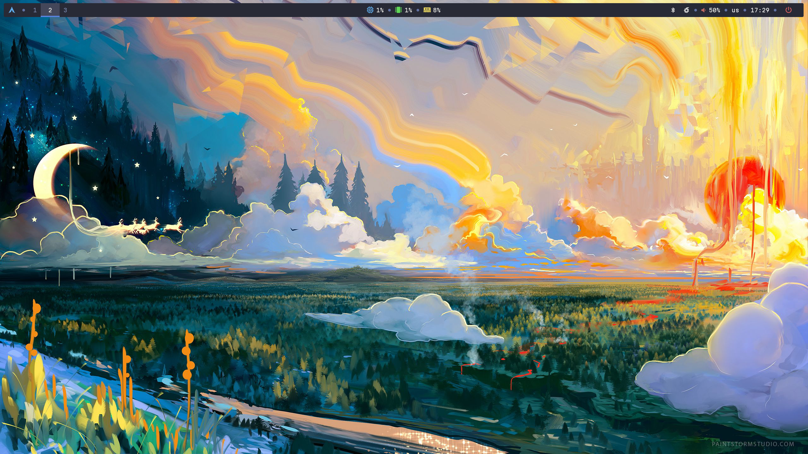
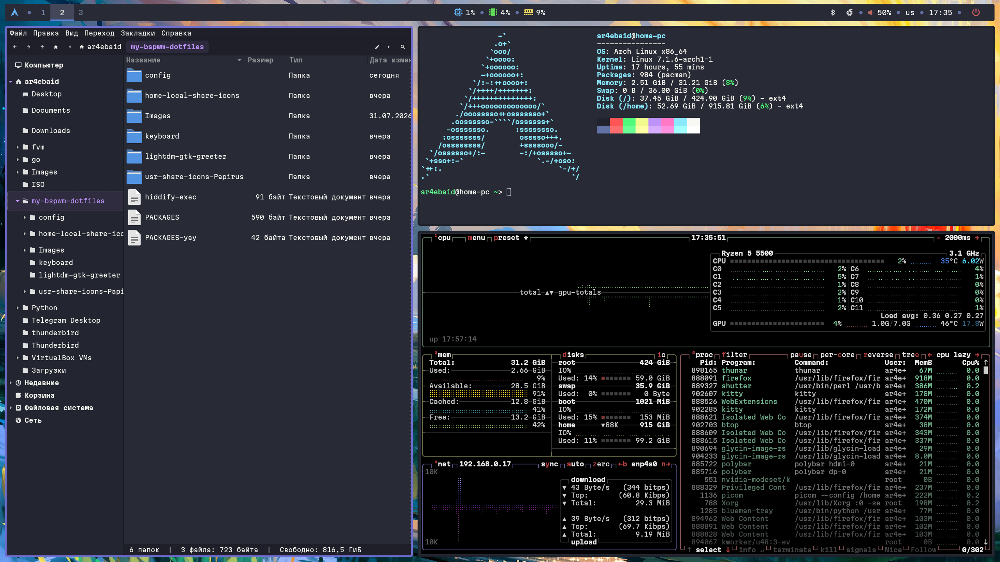

# Моя конфигурация Arch Linux + BSPWM

Стандартная конфигурация arch linux с тайлинговым оконным менеджером bspwm.
После установки и переноса всех конфигурационных файлов необходимо вручную активировать темы: глобальная, шрифты, иконки, курсоры.
P.S. Lightdm - конфиг от рута, фоновая картинка - от пользака.

------

------

